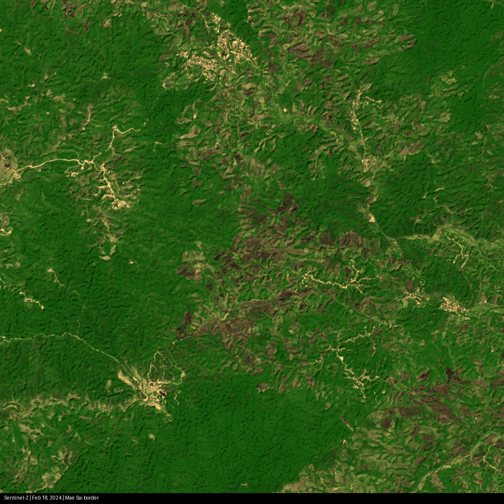
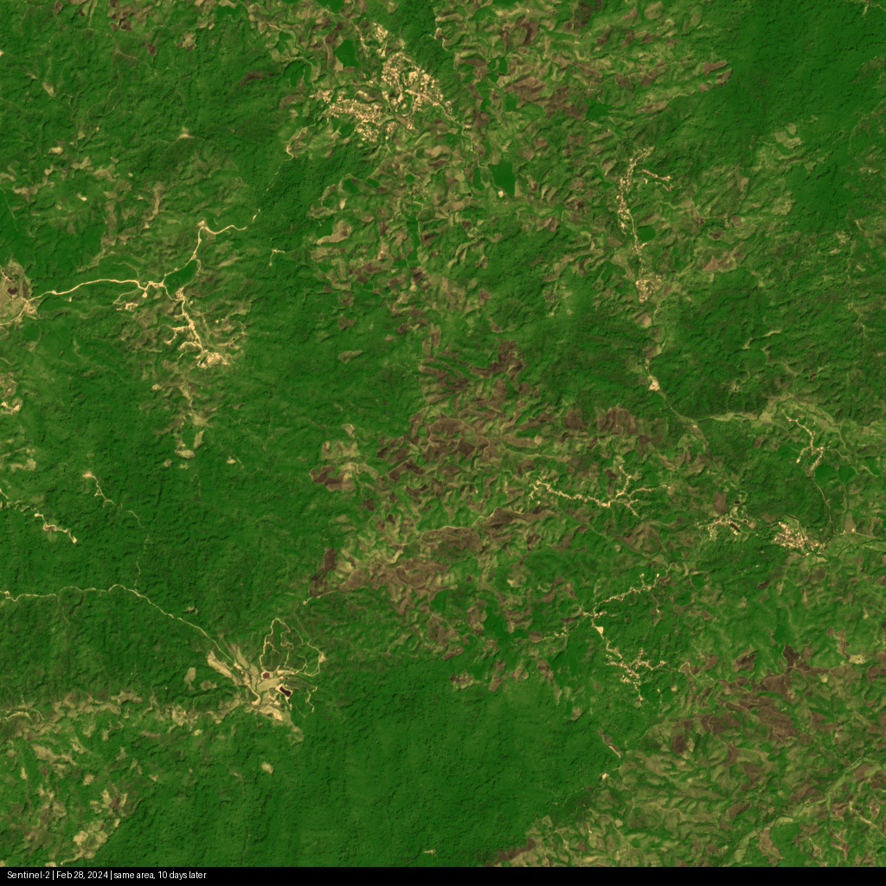
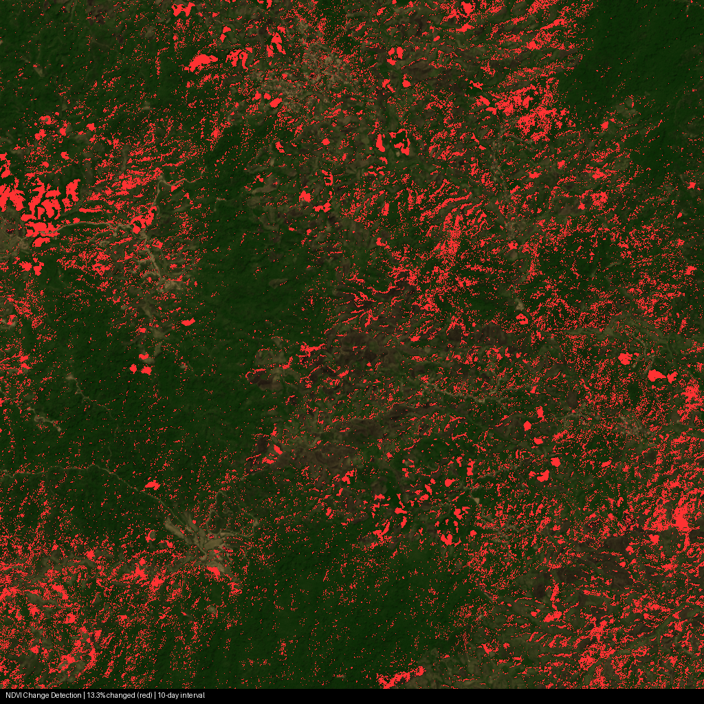
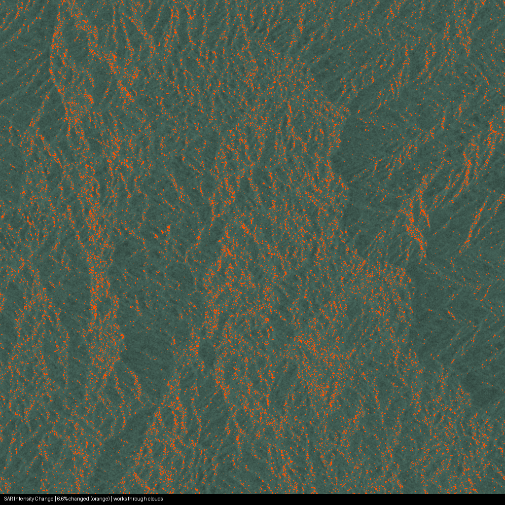
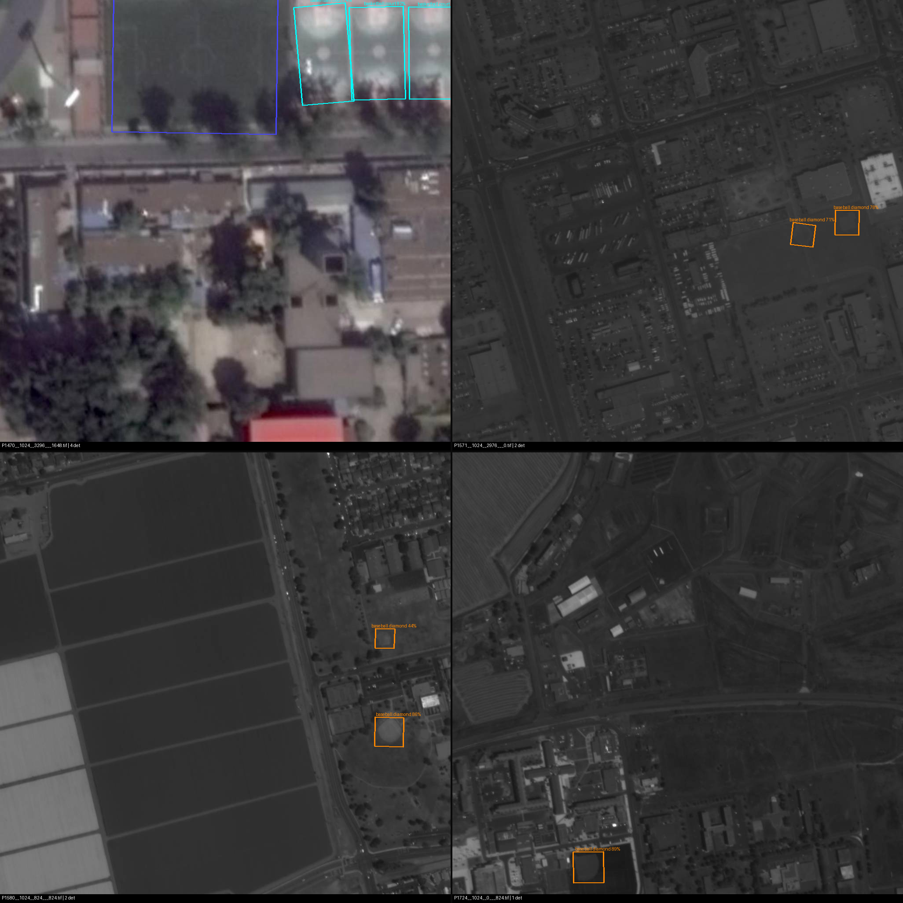
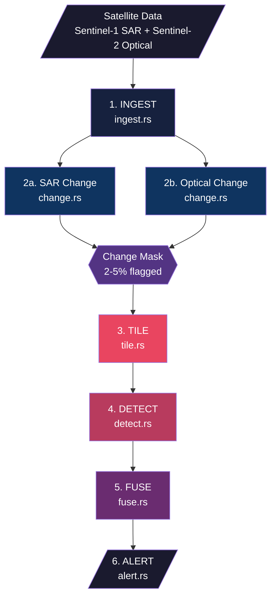

# rimrua

Border intrusion detection pipeline using satellite imagery — written in Rust.

*rimrua* (ริมรั้ว) is Thai for "along the fence" — a system that watches the border.

## How it works

Think of rimrua as a tireless border guard that never sleeps. Given two satellite images of the same area taken at different times, it finds what changed, asks AI what it is, and tells a human.

### Step 1 — Satellite captures the same area at different times




> Sentinel-2 optical imagery of Mae Sai, Thai-Myanmar border. Feb 18 vs Feb 28, 2024 (10 days apart).

### Step 2 — Change detection finds where something changed



> NDVI change mask — red = vegetation changed. 13.3% of the area flagged.
> Only these red zones proceed to the next step. The other 87% is skipped.



> SAR intensity change — orange = ground surface changed. Works through clouds and at night.

### Step 3 — Object detection identifies what changed



> YOLOv8-OBB (trained on DOTA dataset) detecting structures in high-resolution aerial imagery.
> Rust results match Python Ultralytics exactly — same detection count, same confidence scores.

### How the steps connect in production

```
Sentinel 10m (free, every 5 days)
    │
    ▼
Step 2: Change Detection → "3% of area changed"     ← works now
    │
    ▼
Task high-res satellite for those spots only         ← Planet 0.5m / ICEYE 0.25m
    │
    ▼
Step 3: Object Detection → "3 vehicles, 2 camps"    ← works now (tested with DOTA)
    │
    ▼
Step 4: Alert → GPS coordinates + GeoJSON            ← works now
```

## Architecture



| Step | File | Technique | Crate | Reference |
|---|---|---|---|---|
| 1. Ingest | `ingest.rs` | TIFF decode + band de-interleave | `tiff` 0.9 | |
| 2a. SAR Change | `change.rs` | Coherence: `\|<s1*conj(s2)>\| / sqrt(<\|s1\|^2>*<\|s2\|^2>)` | `rustfft` + `num-complex` | Zebker & Villasenor 1992 |
| 2b. Optical Change | `change.rs` | NDVI: `(NIR - Red) / (NIR + Red)` | `ndarray` | Rouse et al. 1974 (NASA) |
| 3. Tile | `tile.rs` | SAHI — only tile changed regions (skip 95-98%) | `ndarray` 0.16 | Akyon et al. 2022 |
| 4. Detect | `detect.rs` | YOLOv8-OBB (DOTA, 15 classes) + Probabilistic IoU NMS | `ort` 2.0 | Jocher 2023, Llerena 2021 |
| 5. Fuse | `fuse.rs` | Bayesian fusion `P = 1 - prod(1 - pi*wi)` + DBSCAN | custom | Ester et al. 1996 |
| 6. Alert | `alert.rs` | GeoJSON (RFC 7946) — Critical/High/Medium/Low | `geojson` 0.24 | |

### Why "change-first"?

```
Detect-everything:  48,000 km² × 640px tiles = 480,000 tiles → $2,900/yr
Change-first:       flag 3% → 14,400 tiles                   → $110/yr
                                                        savings: 96%
```

### Design principles

| Principle | Lesson from |
|---|---|
| No single point of failure | Israel Oct 7 — $1.1B smart fence failed when Hamas destroyed comm towers with cheap drones |
| Human-in-the-loop | Israel post-Oct 7 reform — technology must augment people, not replace them |
| Graceful degradation | Ukraine Delta — if one sensor dies, the rest keep working |
| Multi-source fusion | Ukraine Delta — satellite + drone + ground + OSINT combined |
| Change-first pipeline | Published research — classical screening before ML cuts compute by 92-97% |

## Usage

```bash
# Show pipeline info
rimrua info

# Change detection between two images
rimrua change before.tif after.tif --mode optical --threshold 0.15
rimrua change before.tif after.tif --mode sar --threshold 0.3

# ML detection on an image
rimrua detect image.tif --model models/yolov8m.onnx --confidence 0.5

# Full pipeline from config
rimrua pipeline config/default.toml
```

## Pipeline config

```toml
[input]
sar_before = "data/sar_t1.tif"
sar_after = "data/sar_t2.tif"
optical_before = "data/optical_t1.tif"
optical_after = "data/optical_t2.tif"

[change]
sar_coherence_threshold = 0.3    # lower = more sensitive
ndvi_threshold = 0.15            # vegetation change threshold

[detect]
model = "models/yolov8m.onnx"
confidence = 0.5
tile_size = 640
overlap = 0.2

[alert]
format = "geojson"               # geojson | json
output = "output/alerts.geojson"
```

## Tech stack

| Component | Crate | Pure Rust? |
|---|---|---|
| TIFF decode | `tiff` 0.9 | Yes |
| SAR coherence | `rustfft` 6.2 + `num-complex` 0.4 | Yes |
| Arrays | `ndarray` 0.16 | Yes |
| ML inference | `ort` 2.0 (ONNX Runtime) | No (C++ FFI) |
| Geometry | `geo` 0.28 | Yes |
| GeoJSON output | `geojson` 0.24 | Yes |
| CLI | `clap` 4 | Yes |
| HTTP API | `axum` 0.7 | Yes |
| Parallelism | `rayon` 1.10 | Yes |

~90% pure Rust. Only `ort` requires C++ FFI.

## Project structure

```
src/
├── main.rs      CLI (pipeline, change, detect, info)
├── types.rs     GeoTile, Detection, Obb, ChangeAlert, Config
├── ingest.rs    GeoTIFF → GeoTile (band de-interleave, normalize)
├── change.rs    SAR coherence + NDVI change detection
├── tile.rs      SAHI-style tiling (skip unchanged areas)
├── detect.rs    ONNX inference + Probabilistic IoU NMS
├── fuse.rs      Bayesian fusion + DBSCAN clustering
└── alert.rs     GeoJSON / JSON output
```

## Testing

### Unit tests

```bash
cargo test
```

### Synthetic end-to-end test

```bash
# 1. Generate test images
python3 -c "
from PIL import Image
import numpy as np
before = np.full((1280, 1280, 3), [34, 139, 34], dtype=np.uint8)
Image.fromarray(before).save('data/test_before.tif')
after = before.copy()
after[400:500, 400:500] = [200, 200, 200]
after[500:510, 400:600] = [160, 140, 100]
Image.fromarray(after).save('data/test_after.tif')
"

# 2. Run change detection
cargo run -- change data/test_before.tif data/test_after.tif --mode optical --threshold 0.05

# Expected: Change detected: ~12000/1638400 pixels (0.7%)
```

### Real satellite data test

```bash
# 1. Download Sentinel-2 image pair from browser.dataspace.copernicus.eu
#    - Pick a location, two dates 2-4 weeks apart, cloud-free
#    - Download B04 (Red) + B08 (NIR) as GeoTIFF

# 2. Run
cargo run -- change data/sentinel2_t1.tif data/sentinel2_t2.tif --mode optical

# Expected: 1-5% change for most areas
```

### Full pipeline with ONNX model

```bash
# 1. Export YOLOv8-OBB (DOTA pretrained) to ONNX
pip install ultralytics
python3 -c "from ultralytics import YOLO; YOLO('yolov8n-obb.pt').export(format='onnx', imgsz=640)"
mv yolov8n-obb.onnx models/

# 2. Run pipeline
cargo run -- pipeline config/default.toml

# 3. Open output/alerts.geojson in QGIS → verify alert locations on map
```

## Research context

This project is informed by global border surveillance research:

- **Brazil SISFRON** — operational analog for tropical jungle border (closest to Thailand context)
- **Ukraine Delta** — combat-proven multi-source fusion system processing tens of TB/day
- **Japan ALOS-2** — L-band SAR penetrates forest canopy (critical for Thai-Myanmar border)
- **Israel Oct 7 lessons** — technology must not have single points of failure
- **China DOTA/FAIR1M** — benchmark datasets for oriented object detection in satellite imagery

See `Research/` notes in Obsidian for full literature survey covering 13 regions, 40+ papers, and 15+ operational systems.
